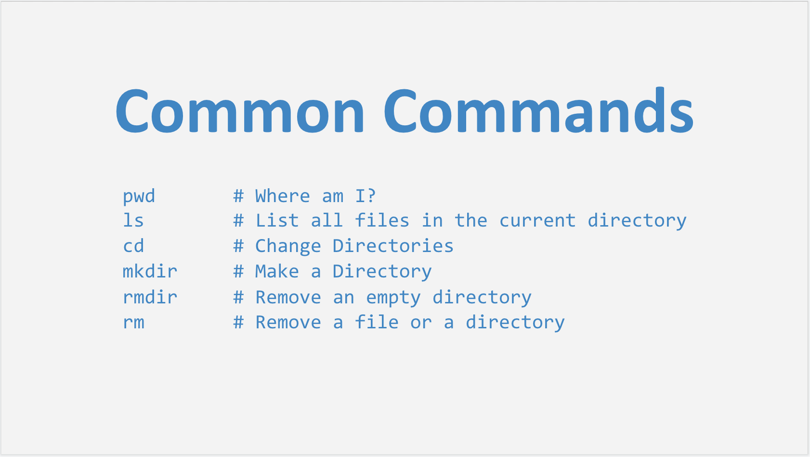
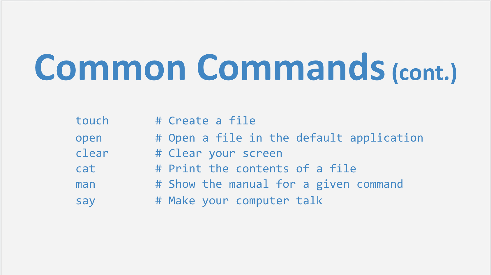

[](https://generalassemb.ly/education/web-development-immersive)

# The Command Line

## Objectives

- What is the Command Line and why use it?
- View files within a directory.
- Create a directory (folder) in which to store a project.
- Create subdirectories to organize a project.
- Create files to contain project information.
- Edit and delete files.
- Navigate within a project.
- Get help from user manuals.

## Exploring the File System

You're probably used to creating files and folders using your operating system's
"explorer" program. The common explorer programs found on each OS are:

- Mac: Finder
- Windows: File Explorer
- Ubuntu: Files

On unix-like systems (sometimes referred to as *nix or POSIX), all your files are
stored in your home folder. On Windows, your files are usually stored in "My
Documents".

You might see `~` or `$HOME` used to refer to your home folder on unix-like
systems.

### Code Along: Explore the Home Directory

Open your file explorer application. Note the files you
see there.

_Note: New windows don't open to the Home directory by default for Mac users. In
order to find this directory, click on **Go** and then **Home** at the top left
of the computer screen._

Now, open your terminal emulator. By default, new sessions start in your _Home_
directory. How can we tell? Let's inspect the files in our current
directory with the `ls` command (mnemonic: "list"). You should see the same
files and directories in your explorer and your terminal.

## Directories and Paths

Directories (and subdirectories) are usually represented as "folders" in your
explorer application. They're just convenient ways of grouping files together.
Paths are string (textual) representations of your current place in the file
hierarchy (or "tree").

Examine this path: `/Users/GA`. The leading slash (`/`) is the root of the
file system. The next part `Users` indicates that there is a directory, or
folder, with the name "Users" inside the root of the file system. Within the
"Users" directory is another directory named `GA`. The string
`/Users/GA` is an absolute path to the home directory for the current user
on my machine.

### Absolute Paths

An absolute path shows the unique location of the files and directories within
the file system. No other files can have this path.

Note: It sometimes helps to think of the path as the actual full name of the
file. This is especially true when we are moving or renaming files from the
command line.

Absolute paths:

- Always start with a leading slash, '/'
- Are relative to the root directory of the file system.

The root directory is the top level directory in the tree structure that makes up
your project or file system. When we talk about absolute paths, the paths are
relative to the topmost path of the file system.

### Code Along: Explore the Root Path

In your terminal sessions, figure out what directory you are in by using the
`pwd` command (mnemonic: "print working directory"). What is the topmost
directory in this path? What is the root of the file system?

Open up the Finder and go to the root directory of your filesystem. There are
several ways to accomplish this, but I prefer the `⌘ + ⇧ + G` shortcut in
Finder. Examine the contents of the root directory.

Now, back in your terminal, change your current working directory to the root
of the file system using the `cd` command (mnemonic: "change directory"). What
happens if we type `cd` and then press the "Return" or "Enter" key? Let's wait
before we answer that question.

In order to change to the root directory, we type `cd /`. In this case, we're
giving the `cd` command an absolute path. How do we know it's an absolute path?
Confirm you're in the root directory by using the `pwd` command.

In order to get back to your home directory, you can type `cd ~`, or `cd $HOME`,
or even just `cd`. Try it!

### Relative Paths

Relative paths are paths described with respect to the current working
directory. What command do we use to figure out our current working directory?

So if I'm in my home directory and I see a folder `projects` (how would I see
that?), I can guess the full path to `projects` is `/Users/GA/projects`.
However, since I'm already in the home folder, the `ls` command tells me only
unique part of the name needed to distinguish it from sibling directories.
Sibling directories are directories that exist "beside" other directories,
instead of within them ("child directories") or above them ("parent
directories").

This "partial path" is a relative path. It's pretty useful, since I can use it
to change into the directory by using `cd projects`. So, in addition to taking
absolute paths, `cd` can take relative paths to navigate the file system. Neat!

There are two special relative directories.

- `..` represents the parent directory.
- `.` represents the current directory.

So, in order to navigate to a grandparent (parent of a parent) directory from
the current directory, what command would we use?

### Tab Complete

Files paths can be very long, and typing them by hand is time consuming and
error-prone. Fortunately, your terminal has a feature called tab completion that
fills in file and directory names for you. It behaves a bit like autocorrect on
a smartphone, except that you have to hit the tab key to make it happen.

Tab complete can be used with both relative and absolute paths. If I have a file
called `a-very-very-long-filename.txt` in my current working directory, I can
type `a-v` (the first few letters of the filename) and hit tab, and it will
complete the filename for me.

Let's say I want to type the absolute path to that file, which is
`/Users/GA/trainings/a-very-very-long-filename.txt`. I can do that very quickly
with tab complete! I could type `/U`, then hit tab, then `G` and tab again, then
`t` or `tr` and hit tab, then `a-v` or `a-`, just like above.

Not only is this faster, but it will let you know if the file/directory you're
looking for really exists, preventing lots of common mistakes. If you try to tab
complete a file or directory that doesn't exist, nothing will happen. You should
use tab complete whenever possible!

### Lab: Make a Subdirectory

Now that we're back in the home directory, let's create a place to store all the
work we're going to do in this SEI. Naming can often be difficult, but simple
names are best. Let's create a subdirectory named "sei". Always use lowercase
names for your directories and files.

Before issuing the command in the terminal, bring your explorer window into
focus, the one with the home directory open. Resize and position it so that it
is visible along with the terminal. Now, in the terminal, execute `mkdir sei`
to create the directory (mnemonic: "make directory").

Now, what folder are you in? Did it change by making the new directory?

Create the following directories as well. They should be subdirectories of
`sei`.

- `lessons`
- `homeworks`
- `warmups`
- `projects`
- `tmp`

Verify that your directory structure resembles the following:

```sh
~/sei
├── lessons
├── homeworks
├── warmups
├── projects
├── tmp
```

Now that we have our SEI directory setup, use the `mv` command to move some files into it.

Find where the `cli` directory are
stored (may be in the home directory). Then move those directories into the
`lessons` directory.

## Files

Let's use the `tmp` directory to play around. `tmp` directories are
conventionally used to store files that can be safely deleted. You should never
put anything in them that you want to keep.

### Code Along: Create/Edit a File

Move into the `tmp` directory inside `sei`. Create a new file using the `touch`
command. Let's make a blank text file: `touch name.txt`.

Next open that file in VScode: `code name.txt`. Write your name inside this file
and save it. On a Mac, the shortcut to save a file is `⌘ + S`. You can also
search for the save command (indeed, any command) using the command palette.
Try it by bringing up the palette with `⌘ + ⇧ + P`. Then search for "Save".

Lets quickly take a peek inside the file we just created in our terminal.
Type `cat name.txt`.

Now type `open name.txt`.

See what happened? The file `name.txt` opens in whatever default application
your computer uses for that type of file.

**Question:** Let's say that we didn't mean to call the file `name.txt`, how would we go about
editing the file name to correct it?

### Lab: Copying a Hidden File

Hidden files in your file system are denoted by a leading `.`. You can see these
files using the command `ls -a`.
Create a hidden file `.env`.
Copy this file using the command `cp <original_name> <new_name>` to a new file
named `.newEnv`.
Check your work by typing `ls -a`.

### Code Along: Deleting a File

How do we get rid of this file? We'll use the `rm` command. But first: a
**warning**. This is a very dangerous command. Do not ever press enter after typing
`rm` without being **certain** you're targeting the right file. There's no way
to recover files deleted with `rm`. The same advice goes double with the `r` and `f`
flags. Flags are switches that occur after dashes when issuing commands.

```sh
rm -rf <file_or_directory> # VERY DANGEROUS!
```

### Code Along: User Manuals

Sometimes I forget how to use certain commands on the command line. My first
step, even before Googling, is to read the command's user manual. You can access
the user manual for a command using `man <name_of_command>` in your terminal.
So, to figure out how to use `rm`, you would executre `man rm`. Do so now. You
should see something like this:

```md
NAME
     rm, unlink -- remove directory entries

SYNOPSIS
     rm [-dfiPRrvW] file ...
     unlink file

...
```

### Lab: Delete a File

Read the manual entry for `rm`. When you're done reading, you can quit by
pressing `q`. Delete the `name.txt` file you created in the previous exercise.
Type the command, then check with a colleague before issuing the
command.

### Lab: Cheatsheet

Let's use your new skills to create a reference sheet.

Create a cheat sheet of the unix commands that we've used so far. I like to create 
these kinds of files for reference. Describe each command in your own words. Don't 
just cut and paste from some definition on the web!





### Important Note: Closing Your Terminal

You shouldn't close your terminal by clicking the "X" button. This can leave
processes from that terminal session running in the background which can cause
problems in the future. Instead, you should use a keyboard shortcut to safely
and completely end the terminal session.

On **macOS** you should first press `CTRL + D` in any tabs that are running 
continuous processes like servers, then press `CMD + Q`.

On **Ubuntu** you should use `CTRL + D`. Note that this is only possible
when no process is running in the terminal.

If `CTRL + D` proves to be ineffective. You can end almost any process and 
clear any entered text with `CTRL + C` instead.

### Code Along: Interactive v.s. Non-Interactive Mode

Let's use the `python -m SimpleHTTPServer` command to run a web server in the current directory.

Now try to type and run any command we have used before, such as `pwd` and see what happens.

### Additional Resources

- [Teaching Unix](http://www.ee.surrey.ac.uk/Teaching/Unix/)
- [Unix Cheat Sheet](https://www.rain.org/~mkummel/unix.html)
- [Unix Power Tools](http://shop.oreilly.com/product/9780596003302.do)
- [Explain Shell](http://explainshell.com)
- [TLDR Man Pages](http://tldr-pages.github.io)
- [Command Line Fu](http://www.commandlinefu.com/commands/browse)

## [License](LICENSE)

1.  All content is licensed under a CC­BY­NC­SA 4.0 license.
2.  All software code is licensed under GNU GPLv3. For commercial use or
    alternative licensing, please contact legal@ga.co.
